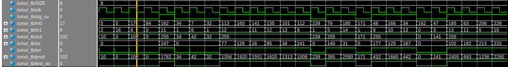

# sv_umul
A module for overflow protected, unsigned integer multiplication.

## Parameters

|Signal    | Description                             |
|----------|-----------------------------------------|
|`DATA_WIDTH`|Parametrizes the width of the IO signals| 

## Inputs

|Signal | Size      |Description            |
|-------|-----------|-----------------------|
|`in0`  |`DATA_WIDTH`|First unsigned integer |
|`in1`  |`DATA_WIDTH`|Second unsigned integer|

## Outputs

|Signal  |Size      |Description            |
|--------|----------|-----------------------|
|`out`   |`DATA_WIDTH`|Product of the input signals `in0` and `in1`. If `out` can not store the product of `in0` and `in1`, `out` is equal to the maximum value it is able to store (i.e., $2^n$ where $n=$`DATA_WIDTH`)|
|`ov`    |`DATA_WIDTH`|Overflow value equal to the difference between the maximum value `out` iff `sig_ov` is `true`           |
|`sig_ov`|1           |Signals overflow to the top of the module|


*Waveform generated from random values by test bench code.*

## How it works

Given two $n$-bit binary values $A$ and $B$, their base ten values can be expressed as sums of powers of two:
$$A = a_0 \cdot 2^0 + a_1 \cdot 2^1 + \cdots + a_{n-2} \cdot 2^{n-2} + a_{n-1}\cdot 2^{n-1}$$
$$B = b_0 \cdot 2^0 + b_1 \cdot 2^1 + \cdots + b_{n-2} \cdot 2^{n-2} + b_{n-1}\cdot 2^{n-1}$$

the product of $A$ and $B$ can then be expressed as the sum $C$:

$$C = \sum_{j=0}^n a_j \cdot 2^j \cdot (b_0 \cdot 2^0 + b_1 \cdot 2^1 + \cdots + b_{n-2} \cdot 2^{n-2} + b_{n-1} \cdot 2^{n-1})$$

by expanding,

$$C = \sum_{j=0}^n a_j \cdot (b_0 \cdot 2^{0 + j} + b_1 \cdot 2^{1+j} + \cdots + b_{n-2} \cdot 2^{n-2 + j} + b_{n-1} \cdot 2^{n-1+j})$$

Given that $a_j$ is a single bit of the $n$-bit binary signal $A$, the term of the sum $C$ is equal to the signal $B$ right shifted $j$ places iff the bit $a_j$ is true which can be expressed in SystemVerilog as:

```vhdl
assign C[j] = A[j] ? B << j : '0;
```

where `c[j]` is the term of the sum being evaluated .
### Dealing With Overflow

Given that $A,B,C$ are $n$-bit signals, given random values for $A$ and $B$ it is likely that $C$ will not be able to store the result however, given that $A$ and $B$ are limited to values less than $2^n$, the maximum product of $A$ and $B$ must be less than $2^{2n}$ so an intermediate $2n$-bit signal must be used to compute the sum $C$.

### Timing Considerations and Future Work

In order to compute the product of the $n$-bit signals $A$ and $B$ with overflow protection, the product signal must pass through $n$ adders of width $2n$ which is not synchronized to the system clock and most likely will result in data corruption.

This can be prevented by adding a clock and enable inputs to the module and a counter register. On enable, the counter $i$ sweeps the range $\{0,1,\cdots,n-1\}$ adding the $C_i$ term to the accumulator.

```
always_ff @(posedge clk) begin
    if (~en)
        acc <= '0;
    else
        acc = acc + c[i];
end

always_ff @(posedge clk) begin
    if (~en)
        i <= '0;
    else if (DATA_WIDTH > i)
        i <= i + '1;
    else
        i <= i;
end
```

While this method does prevent corruption, it also gives the module a execution time of $n$ clock cycles making this method have worse time performance than naive adding for values less than $n$. This can be improved by skipping cycles in which $C_i$ is equal to zero.


